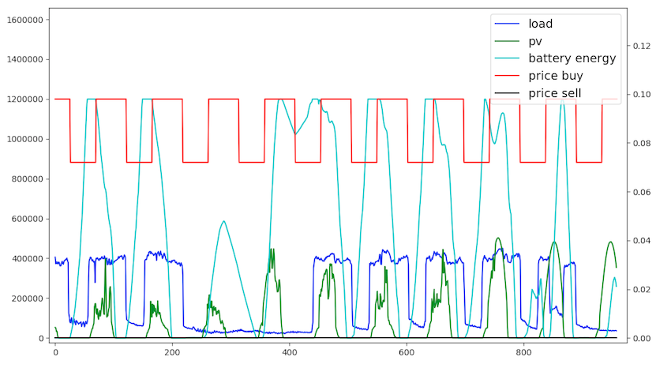
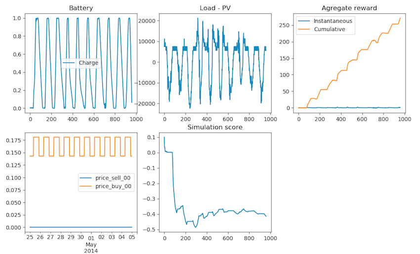
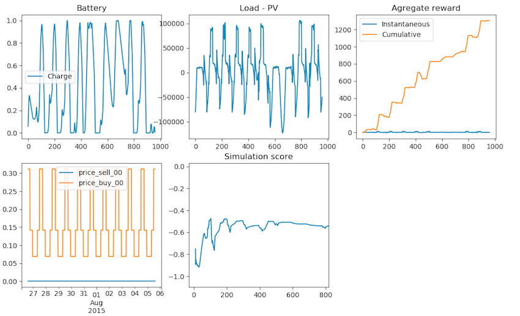

Optim-PV-Battery
===

## Challenge description

Challenge "Power Laws: Optimizing Demand-side Strategies" hosted by DrivenData: https://www.drivendata.org/competitions/53/optimize-photovoltaic-battery/

The objective was to create an optimization algorithm that effectively uses available solar power, building energy consumption, and a battery system to buy, sell, and consume energy in the way that saves the most money and puts the least demand on the energy grid.

In practice, participants had to build a battery controller that was called at each time step to make a proposal for the battery charge at the end of the time step, based on the following variables:
- current date and time
- state of the battery
- consumption and pv generation on previous time step
- predictions for the consumption and the pv generation for the next 24 hours
- buy prices and sell prices for the next 24 hours

Participants were evaluated on several separate periods of 10 days for each of the 11 sites. On each period, a score was calculated with the following metric: score = (money_spent - money_spent_without_battery) / abs(money_spent_without_battery). The final score was the average of the scores obtained on all periods and all sites.

## Approach 1: Dynamic Programming Q-Network

I first started to implement an approach based on Dynamic Programming, due to the structure of the problem and the possibility to solve it recursively. This approach was very close to a Deep Q-Network, except that models for different time steps were separate and learned sequentially starting from the last time step of each simulation.

I made the following choices:
- I used the 'mse' loss so that Q-networks were trained to approximate the expected value of the return (instead of the median value with the 'mae' loss)
- I used double Q-networks inside each DP model:
- In the recursive step where a DP model called the next DP model to fetch its maximum Q-value, I crossed the max and argmax operations from the 2 networks:
`Qvalue = 0.5 * (Qvalue1[indmax2] + Qvalue2[indmax1])` (results from the 2 networks could also be averaged at deploy time to improve the Q-value approximation)
- I considered that action were constants over 4 time steps (= 1 hour) to limit the number of consecutive DP models
- I used a simple Data Augmentation scheme, that consisted in random shifts of the pv series with respect to the load and price series

I did not have much time to benchmark this approach, but it seemed to be limited in the following ways:

- Q-Networks cannot deal with continuous action space, which forces to discretize the action space of proposed battery charges
- If the discretization of the action space is very fine, then we tend to over-estimate the Q-values due to the max operation (though double Q-Networks help with this)
- Since models are learned sequentially and calling each other, model errors tend to propagate (this could only be mitigated at a cost of calling models less frequently)

## Approach 2: Policy Network

During the implementation of the DP approach, I actually came to see an alternative which seemed more optimal. Indeed I understood that all operations implemented in the simulate_timestep() function of the test engine could be implemented into a DL framework such as Keras. 

To clarify, this simulate_timestep() function was the "physical engine" called at each time step of the simulation:
- it computed an effective battery charge given the proposed battery charge and the battery constraints
- it then computed the energy taken from the grid in both cases with and without battery
- it then computed the money spent in both cases with and without battery

Being able to implement this function directly into the model architecture meant being able to directly optimize the reward with respect to the policy network. This may seem anecdotal, but it was a strong specificity that one cannot find in usual problems. Indeed most RL policy implementations use techniques such as Reinforce for training (see e.g. http://www0.cs.ucl.ac.uk/staff/D.Silver/web/Teaching_files/pg.pdf), since the simulation / sampling process stays "exterior" to the model architecture.

So I ended up coding a policy network, which directly acted as the battery controller and gave in output the proposed battery charge. On top of this policy network, further layers (without any parameters to learn) performed the "simulation work". 

Finally the loss of this global architecture was set as the competition score: `money_saved / abs(money_spent_without_battery)` (the denominator had actually no influence on the optimal policy for a given simulation, but it enabled to prioritize learning to save money when the factor was small). In this way, **Keras's optimizer was directly doing the job of minimizing the simulation score**.

The most important trick to make this approach work was related to the policy network output. Indeed, since the battery charge was bounded in its allowed range, any exploration of the policy network outside of this allowed range would lead to zero gradients. This was analogous to the "dying ReLU" issue, but even more problematic since it would affect the whole network.

To solve this, I ended up with a solution with 6 outputs of the policy network:
- 3 sigmoid outputs giving the proposed position of the charge w.r.t. different ranges:
    - 1 for the allowed range [0,1] coming from the battery capacity
    - 1 for the allowed range coming from the current charge and the power limits
    - 1 for the combination of the 2 previous ranges)
- 3 softmax outputs to weight the proposed charge resulting from each of the 3 sigmoid outputs
- This enabled to make sure that the gradient would never fully "die", and also gave a lot of degrees of freedom for the system not to get stuck in local minima

Here's a list of other choices:
- Due to the strong constraints on computing time, the policy network was only applied every 4 time steps (= 1 hour), and the policy network gave its 6 outputs for each of the 4 following time steps
- For the same reason, I did not used any Convolutional layers in the policy network, but only Dense layers
- I used the same Data Augmentation as for Dynamic Programming, consisting in random shifts of the pv series with respect to the load and price series
- I merged train/ and submit/ data in the final training
- The total number of time steps learned at the same time in the policy network was a tradeoff between the increase in computation time, and the potential benefit of having a longer policy horizon (it was set to 6 days in final results, but I'm not sure whether this choice gave a significant gain compared to shorter horizons)

## Results

Overall, the whole approach ended up at position 6, with an average simulation score of -19.5 (the winning approach reaching an average score of -20.1).

Taking some time for testing after the competition, I realized that my submission actually had an overfitting problem. Indeed, when training only on train/ and keeping submit/ as validation data, the overfitting regime was reached way before the moment I had stopped the training for the submitted models.

To cope with this, I implemented afterwards a stronger Data Augmentation, consisting not only of random shifts of the pv series by a random integer number of days, but a pure random shift of the pv series inside the same period_id (this means that the corresponding time of the day could be asynchronized between pv, load and price series).

Another way to cope with this would be to regularize the network, for example with Dropout layers.

Example of results on site_id = 29, period_id = 7, battery_id = 2:

Example of results on site_id = 32, period_id = 3, battery_id = 2:

## How to run the code

### Fetch challenge data
- Fetch challenge data from https://www.drivendata.org/competitions/53/optimize-photovoltaic-battery/data/
- Copy it into /data/

### Train Dynamic Programming Q-networks
- /source/train_DP.ipynb

### Train policy networks
- /source/train_policy.ipynb

### Deploy policy networks
- Copy trained models and norms into /deploy/assets/

### Test on submit data to get public leaderboard score
- /deploy/simulate.py

### Visualize results
- Run environment: /deploy/env.py
- Visualize environment: /deploy/visualize_env.py

